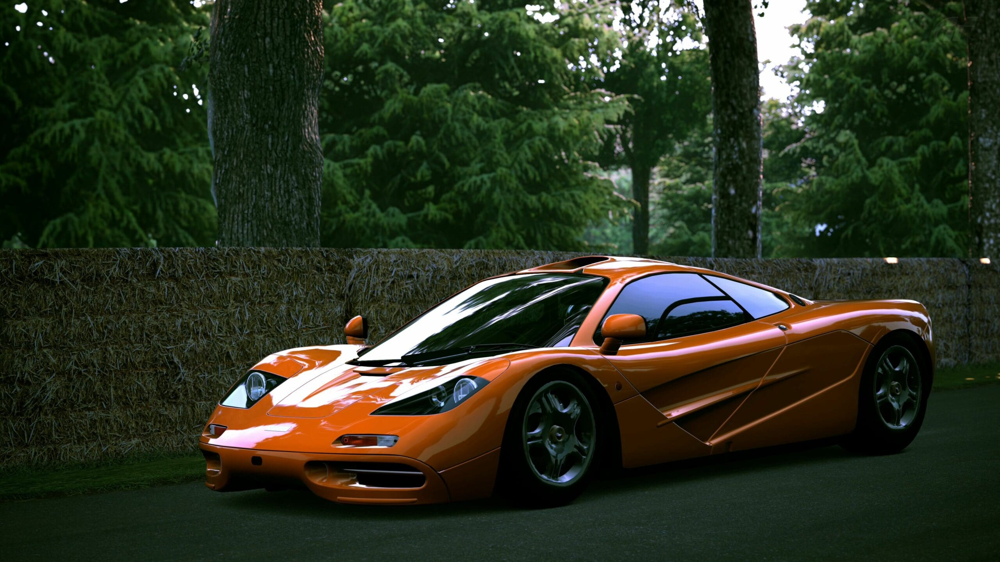
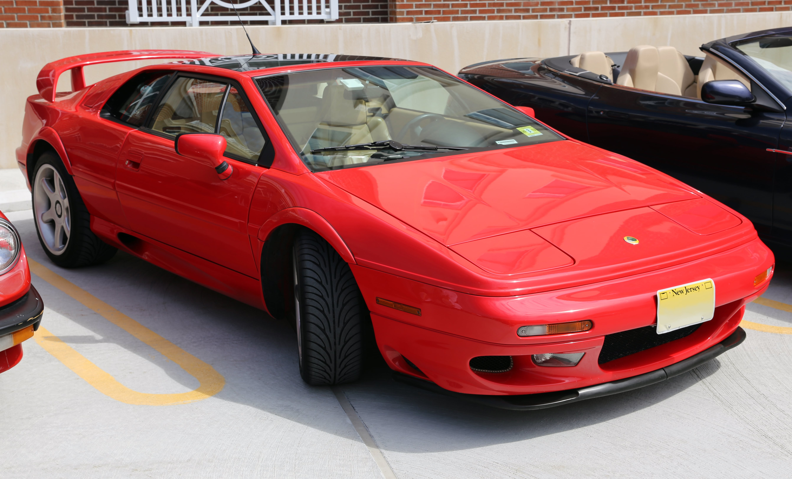

# LOMOTOR

Welcome to **LOMOTOR** – Your Ultimate Destination for Car Enthusiasts!

## Mansour Lo Lo

- **Email:** mansourlol440@gmail.com

---

## Table of Contents

1. [Introduction](#introduction)
2. [Navigation](#navigation)
3. [Featured News](#featured-news)
4. [Iconic Cars](#iconic-cars)
5. [Contact Us](#contact-us)

---

## Introduction

Experience the magic of cinematic roads with our unique car experiences. At LOMOTOR, we blend the thrill of the open road with the magic of storytelling, creating unforgettable moments at every turn.

---

## Navigation

Our easy-to-use navigation allows you to explore different sections of our website effortlessly.

- **Home:** Learn about the magic of cinematic roads.
- **About Cars:** Discover the latest updates on iconic car models.
- **Community:** Join our community and connect with fellow car enthusiasts.

---

## Featured News

### McLaren F1 Unveiling

McLaren has recently unveiled their latest model, the McLaren F1. The car boasts incredible speed and cutting-edge technology, making it a true masterpiece on the roads.

**Date:** March 15, 2023

### Lotus Esprit V8 Modern Makeover

Lotus Esprit V8 enthusiasts are in for a treat as the iconic model gets a modern makeover. The new design and performance upgrades are sure to captivate car enthusiasts around the world.

**Date:** February 25, 2023

*Explore more news on the website.*

---

## Iconic Cars

Discover the iconic cars that have left a mark on automotive history.

- **Rayo McQueen**
- **Batmovil 1989**
- **Mr. Bean's Car**
- **DeLorean**
- **Porsche 911**
- **Volkswagen Beetle**

*Load more iconic cars on the website.*

---

## Contact Us

### Social Media

Connect with us on social media for the latest updates:

- [Instagram](#)
- [Facebook](#)
- [Twitter](#)
- [YouTube](#)

### Find Us

**Address:**
467-DII Johar Town Lahore, Pakistan

**Office Hours:**
Monday - Sunday 10:00 AM - 6:00 PM

### Useful Links

- [About Us](#)
- [Terms](#)
- [FAQs](#)

---

*Follow us for the latest in the world of cars!*

---

*-Thank you for visiting LOMOTOR –*
